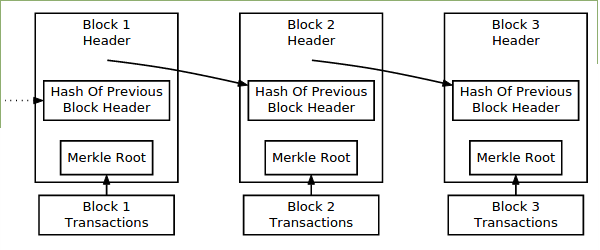

# Chapter 1: The Blockchain

## Background

The most important and fundamental tool of a bank is a ledger, a written record of transactions and balances for each account held at the bank. Without this ledger, it would be difficult if not impossible to keep track of the ownership of assets and liabilities of both the bank's customers and the bank itself. Similarly, a ledger is also fundamental to bitcoin. This ledger is called a “blockchain” and stores a complete record of every transaction that has been accepted by the bitcoin network since the launch of the “genesis block” at the beginning of bitcoin's existence. The blockchain is stored and maintained by bitcoin “full nodes,” which are required for broadcasting and relaying transactions on the bitcoin network.  

  
**Simplified bitcoin blockchain.  

