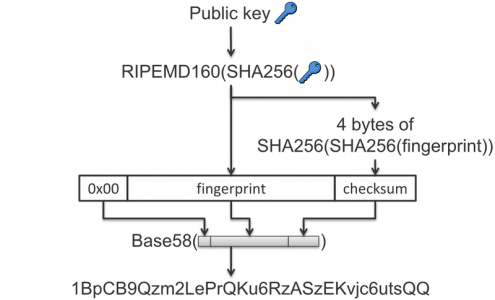
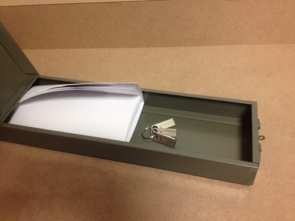
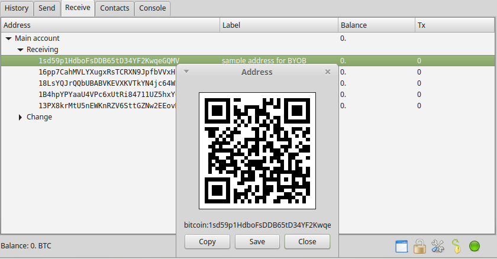
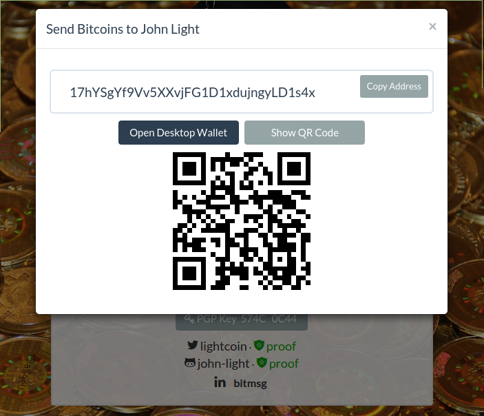
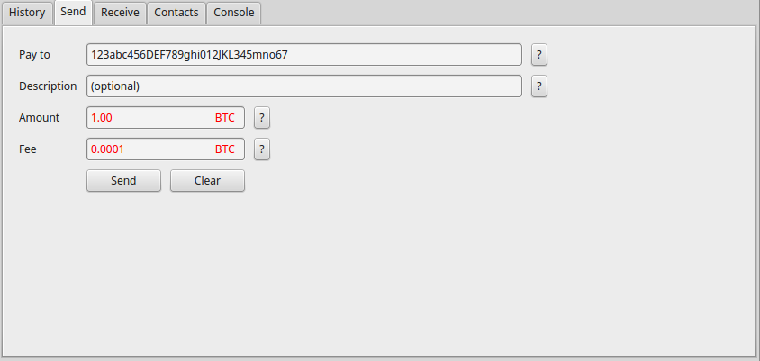

# Chapter 2: Storing, Receiving, and Sending Bitcoin

##Background  
Just as banks enable the sending and receiving of money from one bank account to another, so too does bitcoin enable the sending and receiving of money from one account to another. Bitcoin transactions are, in their simplest form, irreversible, so it's very important to make sure that bitcoin is sent to the correct address of the intended recipient. Bitcoin makes use of elliptic-curve cryptography to secure accounts.[^17] A bitcoin account is made up of two parts:  
* a public address  
* a private key  

The public address is derived from a hash of the public key which corresponds to the private key of the account.  

  

<i>How a bitcoin address is created.[^18] 

The private key is the computer file that is required to spend bitcoin. This file must be secured against unauthorized access to prevent bitcoin from being stolen.  

##Securing Private Keys
<b>Encryption (Good) </b>   
The most simple way of securing private keys is by encrypting them. Most bitcoin wallets offer this feature, which allows you to set a password that you must enter each time you try to send bitcoin to another address. This is a good way to secure your “hot wallet.” Note that encryption alone does not protect your private keys against malware known as “keyloggers,” which can track your keystrokes when you type in your encryption password and send your password back to the hacker. The hacker can then use malware to steal your encrypted wallet file and use the keylogged password to decrypt the file and send your bitcoin to the hacker's own address. If you choose to encrypt your private keys, be sure to write your password down and store it in a safe place. Put a plan in place to leave the encryption password or unencrypted private keys with a trusted friend or family member in case anything happens to you. If your password is forgotten or lost, your bitcoin may be lost forever.  

<b>Offline “Cold” Storage (Better)</b>  
One solution to the keylogger problem is to generate, encrypt, and store your private keys on a computer that remains disconnected from the Internet. This greatly increases the difficulty of compromising the private keys since the attacker would have to have physical access to the machine storing them, or otherwise compromise them through complicated side-channel attacks. To spend bitcoin using offline private keys, you create an unsigned transaction on the online computer, transfer it via memory media such as USB or CD-R to the offline computer, sign the transaction with the private keys on the offline computer, and then transfer the signed transaction back to the online computer and broadcast it to the bitcoin network. This method can be a cumbersome solution to deal with, and while it doesn't completely protect the private keys – the memory media could be infected by sophisticated malware, potentially compromising the private keys – the chances of a successful attack are greatly decreased. Hardware wallets can make this method easier and more secure to manage.  

<b>Multisignature Cold Storage (Best)</b>  
Unlike cash or precious metals, bitcoin is programmable. Bitcoin allows you define in specific ways how and when money can be spent, and this feature can help provide additional security for your bitcoin through the use of multisignature accounts. A multisignature account requires multiple digital signatures to be added to a transaction before bitcoin can be sent to another address. Also referred to as “m-of-n,” these accounts can be designed to require 2-of-2 signatures, 2-of-3, 3-of-5, and so on. These accounts are great for maintaining cooperative control over funds, such as the case of maintaining group control over a corporate treasury account rather than trusting one person with control of the account. This feature can also be used to create individual accounts that are more secure than using a “single signature” address.  

To create a cold multisignature account, you need to know the public keys – not the public addresses, but the actual public keys – of all of the accounts you want to be able to sign transactions with. Some bitcoin wallet software makes these public keys easy to export and import, others require more work. The private keys for each of the single key accounts used to generate the multisignature account must be generated offline to be considered “cold.” As of the time of writing the First Edition of this publication, reliable open source wallets which support cold multisignature accounts and give the user full control of all private keys include:  
* Electrum[^19]
* Bitcoin Armory[^20]  
* CoinVault/mSIGNA[^21]  

<b>Creating Wallet Backups</b>  
Life happens, and when life takes a turn for the worst, it's always good to have backups of vital data such as medical records, tax documents, sentimental photographs, and now, bitcoin wallets. All bitcoin wallet software provides a relatively easy way to backup your bitcoin wallet data, specifically the private keys needed to spend your bitcoin. Be careful when backing up this sensitive data – if anyone gains access to the files that contain the private keys needed to make transactions with your bitcoin accounts, they will be able to access your transaction data and take control of your bitcoin. To guard against this, use multisignature accounts and store a backup of each key needed to sign transactions in a separate location e.g. one in a fireproof safe, another in a safety deposit box, another with a family member, etc, and using multiple kinds of storage media e.g. paper wallet backup, USB backup, and CD-R backup.  

<i>Paper and USB wallet backups.</i>[^22]  

<i>Use the checklist in Appendix A to make sure you have taken the proper steps to securing your private keys before attempting to receive bitcoin for long-term storage using your bitcoin wallet.  

##Receiving Bitcoin  
After bitcoin private keys are secured, the corresponding public address can be used to reliably receive bitcoin. To receive bitcoin directly to an address, open a bitcoin wallet, navigate to the “receive” tab, copy one of the addresses listed, and send the address to whoever or whatever is sending you bitcoin.  

<i>Receiving bitcoin with a sample bitcoin address.</i>  

You can verify that the sender has received the correct address by verifying out-of-band using a secure voice connection, using the built-in Payment Protocol, or using a protocol such as the Blockchain Name System, which links complex-looking bitcoin addresses to human-readable names.[^23] [^24]  

<i>Receiving bitcoin with a Passcard.</i>  

Note that once a bitcoin address is linked to an identity, all transactions sent to and from that address can be linked to that identity and fully traceable using the public bitcoin blockchain. One way to preserve financial privacy when receiving bitcoin is to generate a new address for each transaction and never link the address to any static identity. Some wallets will generate new addresses for recipients automatically. There is also software that will generate addresses for senders automatically using “stealth addresses.”[^25]  

Once a transaction has been sent to your address, it can take ten minutes or more for the transaction to be “confirmed” and included in a block. The more blocks that are added to the blockchain after a transaction has been confirmed, the less likely it will be that the sender can reverse the transaction. For low value transactions, or transactions for which there is an established trust relationship with the sender, one confirmation is enough to consider the transaction finalized. Most bitcoin merchant payment processors will even accept zero confirmation transactions so that a customer does not have to wait for a transaction when they are checking out online or in a store.  

##Sending Bitcoin  
Once you have received bitcoin, you will be able to send bitcoin to another bitcoin address, whether it is another one of your addresses or one that is under someone else's control. Open your bitcoin wallet, navigate to the “send” tab, paste the recipients bitcoin address or scan a QR code containing their bitcoin address, enter in the correct amount to send, double-check that the recipient address is correct, if a miner fee is needed then include a small miner fee (a couple of cents USD worth of BTC will work), then press “send.” Transaction complete! [^26]  

<i>Sending bitcoin to a made-up bitcoin address.</i>  

If your bitcoin wallet supports the Blockchain Name System protocol, you can just type in the recipient's passname where you would normally put their bitcoin address, and the bitcoin will be sent to the address the recipient has added to their Passcard (if they have added one).  

It's important to remember that it is very difficult – potentially impossible – for the sender of a bitcoin transaction to reverse a payment, so be sure to double-check that the receiving address and the amount being sent (including the fee) is correct. If the address is incorrect, the bitcoin that is sent to it could be lost forever.  

[^17] Various Authors (2015, January 21). Technical background of version 1 Bitcoin addresses. Retrieved February 13, 2015, from https://en.bitcoin.it/wiki/Technical_background_of_version_1_Bitcoin_addresses  
[^18] http://en.bitcoinwiki.org/File:BitcoinAddress.png  
[^19] https://electrum.org/  
[^20] https://bitcoinarmory.com/  
[^21] https://github.com/ciphrex/CoinVault  
[^22] http://blog.coinbase.com/post/33197656699/coinbase-now-storing-87-of-customer-funds-offline  
[^23] Andresen, G., & Hearn, M. (2013, July 29). BIP 70: Payment Protocol. Retrieved February 26, 2015, from https://github.com/bitcoin/bips/blob/master/bip-0070.mediawiki  
[^24] https://github.com/namesystem/namesystem/wiki/FAQ  
[^25] http://sourceforge.net/p/bitcoin/mailman/message/31813471/  
[^26] These are the steps for completing a bitcoin transaction with a single key account where the private keys are stored unencrypted on a computer that is hooked up to the Internet i.e. a “hot wallet”. If your wallet it encrypted, you will need to enter the decryption password.  