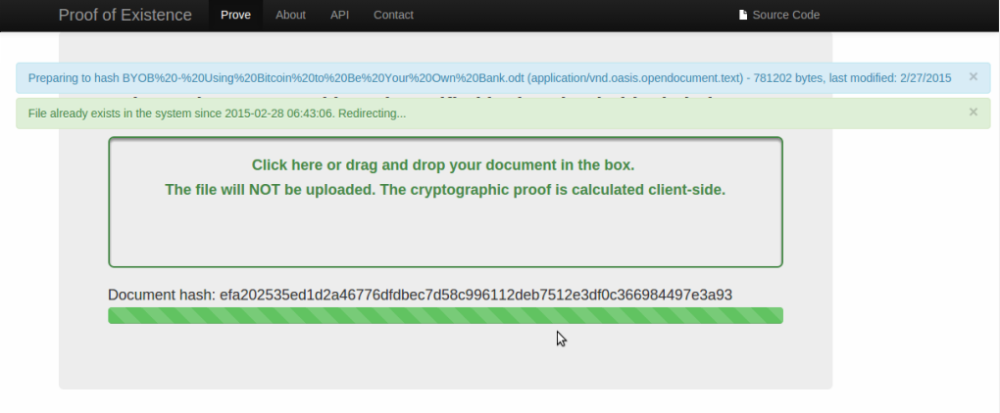

# Chapter 4: Notarizing Digital Files with Bitcoin

##Background
All of the uses of bitcoin discussed in this book have so far had to do with using bitcoin to replace the functions of a bank that directly deal with managing money:  
* Creating new money  
* Storing money  
* Sending money  
* Receiving money  
* Raising money  

Most banks also offer their customers financial services which are indirectly related to the management of money. One of those services is that of the notary public. The duties of a notary public include, but are not limited to:
* Identifying the person(s) appearing before them using “significant proofs of evidence,” such as a passport, birth certificate, driver's license, etc.  
* Comparing signatures on different documents to ensure that they match
* Taking an affidavit or declaration and recording such statements
* Taking acknowledgement of execution of a document and preparing a certificate of acknowledgement
* Sealing or stamping and signing the certificate of acknowledgement[^26]  

Generally speaking, it is a notary's job to certify that at a certain time, certain people agreed to the existence of a certain document, typically a contract, deed, or other such title of obligation or ownership. 
While not independently capable of reproducing all of a notary's functions, such as verifying the identity of a file creator, the blockchain can be used for provably time-stamping digital files. A digital file is put through a one-way mathematical function known as a “hash,” and the unique output is added as metadata to a small bitcoin transaction, thus forever proving that at a certain time, a certain digital file existed. This functionality can be used to prove the existence of many time-sensitive files, including: 
* Contracts
* Property titles
* Creative works

##Proof of Existence
A service called “Proof of Existence,” one of the first of its kind, was created to offer people an easy way to prove that at a certain block height (the equivalent of saying “at a certain point in time”), a certain digital file existed.[^27]

<i>Hashing a draft of BYOB using Proof of Existence.

To embed a file into the bitcoin blockchain using Proof of Existence, first drag and drop a file that you want to prove exists at a certain time, for example a signed contract, into the big box on the website home page. The document will be hashed client-side (not uploaded to the server), and you will then be presented with a bitcoin address which you need to pay a small amount of bitcoin (typically a few cents USD worth) to have the hash of the file permanently embedded in the bitcoin blockchain. After the block the transaction is included in is confirmed, you will forever have proof that at the time that the block with your file hash embedded in it was added to the bitcoin blockchain, the file that was used to produce the hash existed. You are essentially using math to replicate one of the important functions of a notary public: certifying the existence of a document at a certain time.

