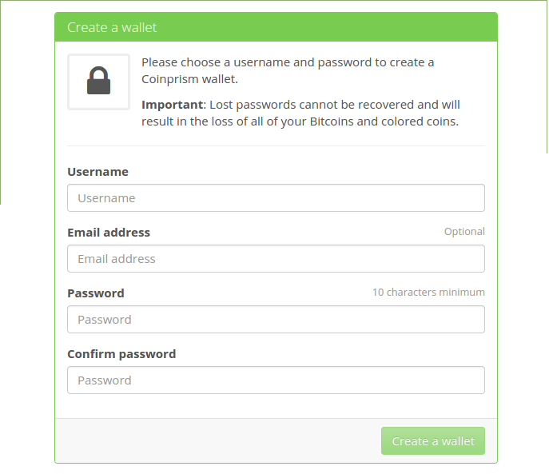
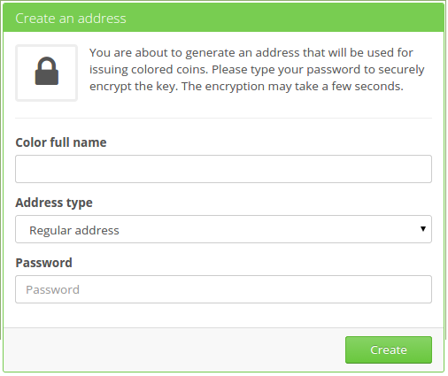

# Chapter 5: Colored Coins

##Background   
After a bank makes a loan or investment, they have the ability to package these assets into securities, which are then sold to private businesses or the general public as an investment. Securities are fungible financial instruments which represent a share of ownership in a corporation (equity/ stock), a credit agreement with another entity (loan/ bond), or ownership rights as represented by an option (derivative). The bitcoin protocol offers users the ability to issue their own fungible assets which are cryptographically secured by the blockchain but represent assets outside of the blockchain: a loan made to an individual or business, equity or revenue share in a company, a redeemable coupon for a product or service, a representation of work put into a project, and more. Anything that can be defined can be issued as an asset on the bitcoin blockchain and traded between accounts.   
 
Assets issued on the bitcoin blockchain are known as “crypto-assets” or, more commonly, “colored coins.”[^28] There are multiple technical specifications for issuing colored coins on the bitcoin blockchain, including Assembly Coins, Counterparty, Omni (formerly “Mastercoin”), and Open  
Assets.[^29] [^30] [^31] [^32] The focus in this chapter will be on the Open Assets protocol.   
 
Note: In all of the examples in this book so far, we have assumed that the majority of miners are not malicious because the activities described in the examples are compatible with the incentives of bitcoin mining; issuing colored coins is different in that it can jeopardize the security of the blockchain by changing the incentives for miners. For example, if the total value of assets being transferred in a block is $100 billion but the market cap of the bitcoin cryptocurrency is only $10 billion, there are at least $90 billion worth of assets at risk of a 51% attack since the incentive to attack the blockchain would no longer be tied to the price of bitcoin.   
 
Open Assets   
The Open Assets protocol allows you to “color” bitcoin transaction outputs, marking the colored coin that is being issued with a pseudonymous ID that looks much like a bitcoin address. A colored coin issued using the Open Assets protocol looks like this:   
 
``` 
ALn3aK1fSuG27N96UGYB1kUYUpGKRhBuBC``` 
   
 
These colored coins can be given a name in your Open Assets wallet so that they are easily distinguishable, for example “1oz XAU” or “1 share XXXX.” These names will remain private unless you share them outside of your Open Assets wallet.   
 
Coinprism   
Coinprism is a company that offers free web, desktop, and mobile wallets that are used for managing Open Assets colored coins. The desktop wallet is called Colorcore and is currently a command-line tool.[^33] The web and mobile wallets are Coinprism branded and offer an attractive user interface that makes is easy to manage Open Assets colored coins. This guide will show you how to issue and receive colored coins using the Coinprism web wallet.  
The first thing you will need to do is go to coinprism.com and create a wallet.   
 
  
<i>Creating a Coinprism wallet.  
 
The wallet will be created and encrypted client-side, so as long as you are connecting to the website securely and the website is not serving you malicious code, your wallet will be as secure as a desktop wallet. Do not lose your username or password, or you permanently lose access to your wallet.  

To issue a colored coin asset, navigate to the “Addresses & Colors” tab and click “New color.” You will then be shown this form:  
 
  
<i>Coloring an address.  
 
Give the new “color” a name e.g. Gold Bar 1oz, choose what kind of address you're issuing it from (pick “Regular address” if you're not sure), then encrypt your new issuing address with a new password. You will then be shown this form: 
 

 
Here you will enter a short name or ticker symbol e.g. XAU, the Issuer Name (you can make one up or use the real name of the issuer – this will become public data on Coinprism's website), add images for the asset (such as a logo or a picture of the asset the colored coin represents), write a description about the asset (such as a contract detailing how the coin can be redeemed for the backing asset), choose how/ whether or not the asset can be divisible, and choose a class for the asset e.g. currency, stock, bond, commodity, etc. After you have completed this form, click “save.” If your transaction is successful, you will receive a notification indicating that your new asset will be available for management in your wallet within about 15 minutes.  
 
 
 
After the transaction has been confirmed by the bitcoin network, you will be able to choose it from the menu of addresses: 
 
 
 
You will then need to fund the newly created colored coin address to issue a new asset by sending bitcoin to the address. Do this by clicking “fund address” or by sending bitcoin directly to the bitcoin address/ QR code directly below the address selection menu. After the address has been funded, click “Issue coins.” You will then be presented with this form: 
 
 
 
Enter the amount of coins you wish to issue for your asset e.g. if your asset it ounces of gold, enter how many ounces of gold the asset is backed by. Then click “Issue coins.” The software will ask you to enter the password for your colored coins address; enter your password then press “Submit.” Your newly issued colored coins will then be available in your Coinprism wallet. 
 
 
 
To receive bitcoin or assets with the Coinprism wallet, first navigate to the “Addresses & Colors” tab. You will be presented with a drop-down menu next to a QR code representing either a bitcoin address or  Open Asset ID. The “receive assets” account is used to receive Open Assets, and the “receive bitcoins” account is used to receive bitcoin. Copy the address for either option depending on which you are trying to receive and give it to the sender. You can also scan the QR code to send bitcoin or colored coins to your address from a mobile device.   
 
With colored coin technology, you can now use bitcoin to replace banks as issuers of various financial assets.   
 
[^28] http://www.coloredcoins.org/   
[^29] https://coins.assembly.com/   
[^30] http://www.counterparty.io/   
[^31] http://www.omni.foundation/   
[^32] http://www.openassets.org   
[^33] https://github.com/OpenAssets/colorcore   